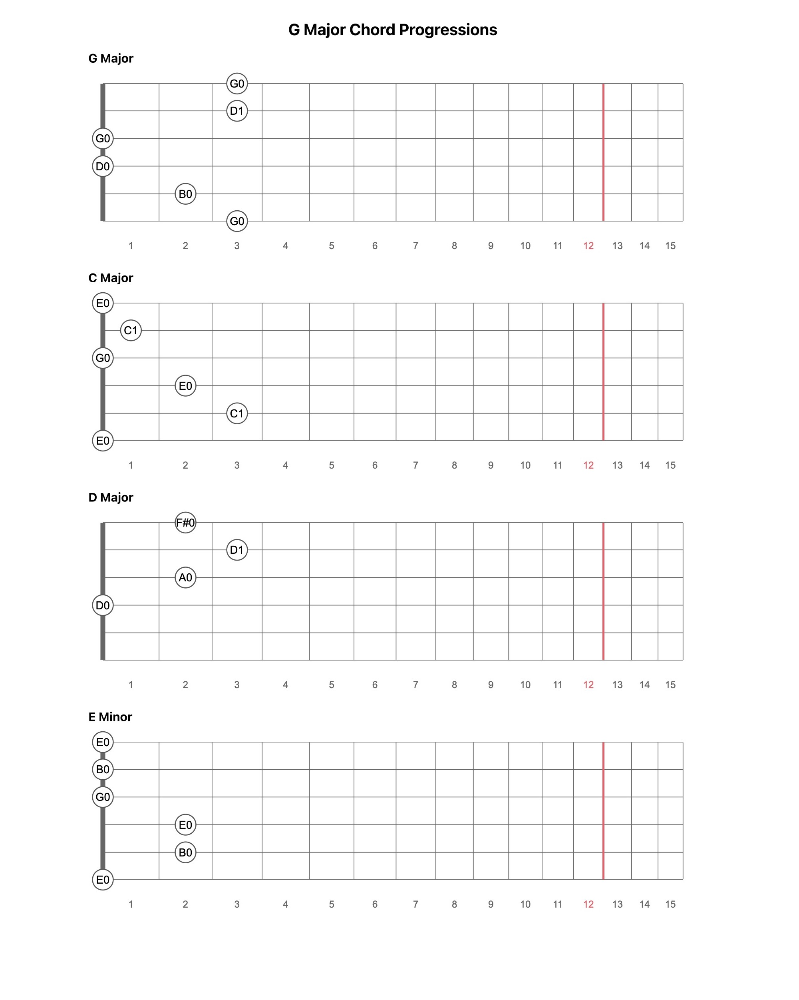

## Fretboard.js Diagram Generator

To generate a diagram, copy `fretboard-model.html` and create a `fretboard.Fretboard()` for each diagram with string and fret numbers. Diagrams are creating using [/moonwave99/fretboard.js](/moonwave99/fretboard.js). Check the docs for more options.

**Example: G Major Chord Progressions**

> pos = positions, s = string, f = fret

```javascript
var chords = [
  { name:"G Major", pos:[{ s: 1, f: 3 }, { s: 2, f: 3 }, { s: 3, f: 0 }, { s: 4, f: 0 }, { s: 5, f: 2 }, { s: 6, f: 3 }] },
  { name:"C Major", pos:[{ s: 1, f: 0 }, { s: 2, f: 1 }, { s: 3, f: 0 }, { s: 4, f: 2 }, { s: 5, f: 3 }, { s: 6, f: 0 }] },
  { name:"D Major", pos:[{ s: 1, f: 2 }, { s: 2, f: 3 }, { s: 3, f: 2 }, { s: 4, f: 0 }] },
  { name:"E Minor", pos:[{ s: 1, f: 0 }, { s: 2, f: 0 }, { s: 3, f: 0 }, { s: 4, f: 2 }, { s: 5, f: 2 }, { s: 6, f: 0 }] }
];

```



**Fretutils.js Functions**

You can generate note lists for any musical instrument using `note_list_generate()` from `fretutils.js`.

**Example**

Generate strings with frets and notes for a guitar with standard tuning. Note: this function is already available in `fretutils.js`.

```javascript
function standard_guitar_strings(total_notes) {
  // -- Create a dictionary of notes for guitar with standard tuning. -- //
  var guitar = {
    's1' : note_list_generate('E0', total_notes),
    's2' : note_list_generate('B0', total_notes),
    's3' : note_list_generate('G0', total_notes),
    's4' : note_list_generate('D0', total_notes),
    's5' : note_list_generate('A0', total_notes),
    's6' : note_list_generate('E0', total_notes),
  };
  return guitar;
}
```

Then run the function as follows for a guitar with 24 frets.

```javascript
standard_guitar_strings(24);
```